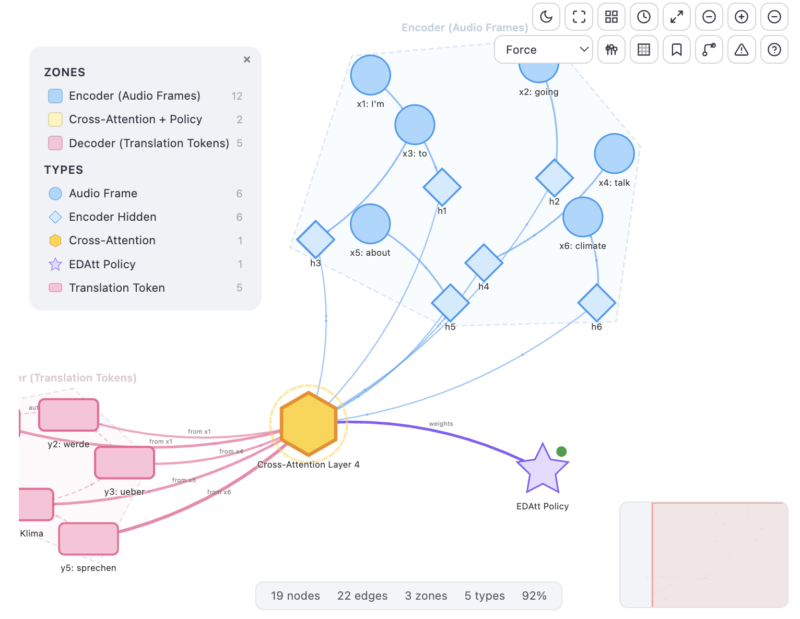
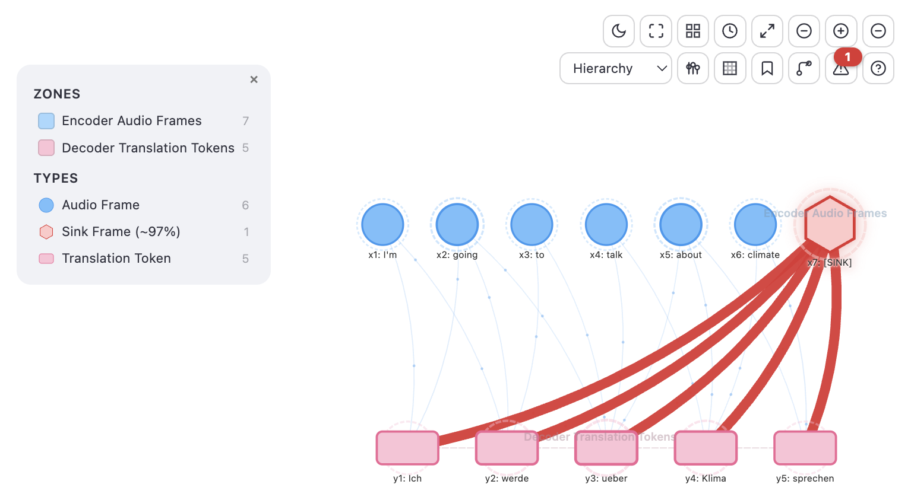
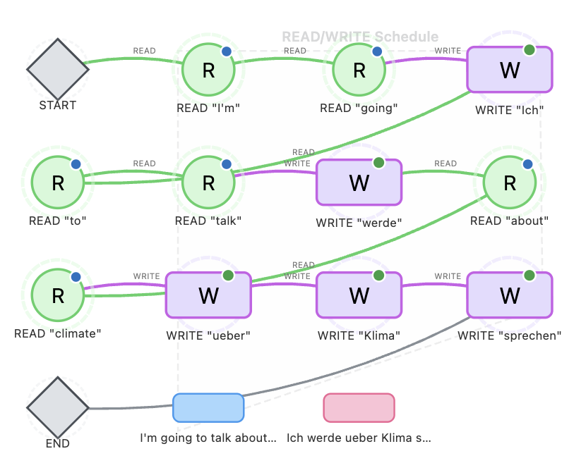

# streamlit-d3-network

Interactive D3.js network graph component for [Streamlit](https://streamlit.io/).

Build rich, explorable network visualizations with zone clustering, multiple node shapes, real-time search, keyboard navigation, and bidirectional Python-JS state.


**[Try the live demo](https://d3-network.streamlit.app/)**

<p align="center">

</p>
<p align="center">

</p>
<p align="center">

</p>

## Installation

```bash
pip install streamlit-d3-network
```

## Quick start

```python
from streamlit_d3_network import st_d3_network, Node, Link

result = st_d3_network(
    nodes=[
        Node(id="a", label="Service A"),
        Node(id="b", label="Service B"),
        Node(id="c", label="Database"),
    ],
    links=[
        Link(source="a", target="b"),
        Link(source="b", target="c"),
    ],
)

if result and result.get("selected_node"):
    st.json(result["selected_node"])
```

<details>
<summary><h2>Features</h2></summary>

### Graph rendering
- **Force-directed layout** with D3.js v7 — smooth, physics-based node positioning
- **5 layout modes** — force, radial, hierarchical, grid, community
- **Zone clustering** — group nodes by zone with convex hull backgrounds
- **7 node shapes** — circle, rect, diamond, hexagon, triangle, triangle-down, star
- **Status badges** — ok (green), warn (yellow), error (red), off (gray)
- **Degree rings** — visual indicator of node connectivity
- **Animated flow particles** along edges
- **Edge labels** and directional arrows
- **Dark mode** — auto-detects Streamlit theme

### Interaction
- **Click** to select nodes — info panel with details, connections, actions
- **Shift+click** to multi-select — summary with type/zone breakdowns
- **Shift+drag** for lasso/box selection
- **Drag** nodes to reposition (positions persist across rerenders)
- **Zoom/pan** with mouse wheel and drag
- **Search** nodes by label (`/` to focus)
- **Legend** filtering by zone and type
- **Action buttons** — define custom actions per node type, results sent to Python

### Keyboard shortcuts

| Key | Action |
|-----|--------|
| `?` | Help overlay |
| `/` | Focus search |
| `F` | Fit to viewport |
| `Esc` | Clear selection |
| `Tab` | Cycle through nodes |
| `C` | Center on selected node |
| `L` | Toggle legend |
| `M` | Focus mode (hide all chrome) |
| `G` | Cycle layout mode |
| `N` | Cycle neighbor depth (1/2/3) |
| `X` | Critical path — highlight warn/error nodes |
| `K` | Community detection coloring |
| `J` | Voronoi territory overlay |
| `Q` | Zone flow overlay |
| `D` | Toggle dark mode |
| `H` | Heatmap overlay |
| `B` | Bookmark current view |
| `P` | Path mode |
| `S` | Snapshot positions |
| `I` | Status filter |
| `Z` | Collapse/expand zones |
| `T` | Tuning panel |
| `+`/`-` | Zoom in/out |
| `Ctrl+A` | Select all nodes |
| `Ctrl+Z` | Undo |

### Bidirectional state
- **Python to JS** — highlight nodes, zoom to node, filter by zone/type
- **JS to Python** — selected node, triggered action, node positions, zoom transform
- **Persistent layout** — node positions and zoom state survive Streamlit rerenders

</details>

## API reference

### `st_d3_network()`

```python
result = st_d3_network(
    nodes: list[Node],
    links: list[Link],
    *,
    zones: list[Zone] | None = None,
    node_types: dict[str, NodeType] | None = None,
    actions: dict[str, list[Action]] | None = None,
    highlight: list[str] | None = None,
    zoom_to: str = "",
    filter_zone: str = "",
    filter_type: str = "",
    show_labels: bool = True,
    show_hulls: bool = True,
    show_legend: bool = True,
    show_search: bool = True,
    show_export: bool = False,
    show_particles: bool = True,
    layout: str = "force",
    theme: dict[str, str] | None = None,
    height: int = 600,
    key: str | None = None,
)
```

**Returns** a dict with:
- `selected_node` — `{id, label, type, zone, status, data, connected}` or `None`
- `action` — `{key, node_id, node_label, node_type}` or `None` (fire-once)
- `node_positions` — `{id: {x, y, pinned}}` — persisted layout
- `zoom_transform` — `{k, x, y}` — persisted zoom state

### Data types

#### `Node`

| Field | Type | Default | Description |
|-------|------|---------|-------------|
| `id` | `str` | required | Unique identifier |
| `label` | `str` | required | Display label |
| `type` | `str` | `"default"` | Node type key (maps to `NodeType`) |
| `zone` | `str` | `""` | Zone name for clustering |
| `tooltip` | `list[str]` | `[]` | Extra tooltip lines |
| `color` | `str \| None` | `None` | Override fill color (hex) |
| `border_color` | `str \| None` | `None` | Override border color (hex) |
| `radius` | `int` | `20` | Node radius in pixels |
| `status` | `str` | `""` | Status badge: `ok`, `warn`, `error`, `info`, `off` |
| `image` | `str` | `""` | Image URL for avatar |
| `opacity` | `float` | `1.0` | Node opacity |
| `data` | `dict` | `{}` | Arbitrary extra data (shown in info panel) |

#### `Link`

| Field | Type | Default | Description |
|-------|------|---------|-------------|
| `source` | `str` | required | Source node ID |
| `target` | `str` | required | Target node ID |
| `label` | `str` | `""` | Edge label |
| `color` | `str` | `"#adb5bd"` | Edge color (hex) |
| `width` | `float` | `1.5` | Stroke width |
| `dashed` | `bool` | `False` | Dashed line style |
| `directed` | `bool` | `True` | Show arrow |
| `opacity` | `float` | `1.0` | Edge opacity |
| `data` | `dict` | `{}` | Arbitrary extra data |

#### `Zone`

| Field | Type | Default | Description |
|-------|------|---------|-------------|
| `name` | `str` | required | Unique zone key (matches `Node.zone`) |
| `label` | `str` | required | Display label |
| `color` | `str` | `"#e9ecef"` | Zone hull color (hex) |

#### `NodeType`

| Field | Type | Default | Description |
|-------|------|---------|-------------|
| `shape` | `str` | `"circle"` | `circle`, `rect`, `diamond`, `hexagon`, `triangle`, `triangle-down`, `star` |
| `color` | `str` | `"#e9ecef"` | Default fill color (hex) |
| `border_color` | `str \| None` | `None` | Default border color (hex) |
| `icon` | `str` | `""` | Emoji/text inside the node |
| `label` | `str` | `""` | Human-readable type name (for legend) |

#### `Action`

| Field | Type | Default | Description |
|-------|------|---------|-------------|
| `key` | `str` | required | Unique action key (returned in `result["action"]`) |
| `label` | `str` | required | Button label text |
| `icon` | `str` | `""` | Emoji/icon prefix |

## Full example

```python
import streamlit as st
from streamlit_d3_network import Action, Link, Node, NodeType, Zone, st_d3_network

zones = [
    Zone(name="backend", label="Backend", color="#b2f2bb"),
    Zone(name="data", label="Data Layer", color="#ffec99"),
]

node_types = {
    "service": NodeType(shape="circle", color="#b2f2bb", border_color="#2f9e44", label="Service"),
    "database": NodeType(shape="hexagon", color="#ffd43b", border_color="#f08c00", label="Database"),
}

nodes = [
    Node(id="api", label="API Gateway", type="service", zone="backend",
         status="ok", tooltip=["Version: 3.2", "CPU: 45%"]),
    Node(id="auth", label="Auth Service", type="service", zone="backend",
         status="warn", tooltip=["OAuth 2.0"]),
    Node(id="pg", label="PostgreSQL", type="database", zone="data",
         status="ok", data={"version": "16.2", "size": "245 GB"}),
]

links = [
    Link(source="api", target="auth", label="JWT", color="#339af0"),
    Link(source="api", target="pg", label="r/w", color="#f08c00", width=2),
    Link(source="auth", target="pg", label="r/w", color="#f08c00"),
]

actions = {
    "service": [Action(key="logs", label="View Logs"), Action(key="metrics", label="Metrics")],
    "*": [Action(key="details", label="Details")],
}

result = st_d3_network(
    nodes=nodes,
    links=links,
    zones=zones,
    node_types=node_types,
    actions=actions,
    show_hulls=True,
    show_particles=True,
    height=600,
    key="my_graph",
)

if result and result.get("action"):
    st.success(f"Action: {result['action']['key']} on {result['action']['node_label']}")
```

## Export

Enable export buttons with `show_export=True` to allow users to download the graph as PNG or SVG.

## Development

```bash
git clone https://github.com/QuentinFuxa/streamlit-d3-network.git
cd streamlit-d3-network
pip install -e .
streamlit run examples/demo.py
```

> **Note:** Changes to JS/CSS require a server restart (`pip install -e .` + restart Streamlit) because the frontend files are read at module import time.

## License

MIT
